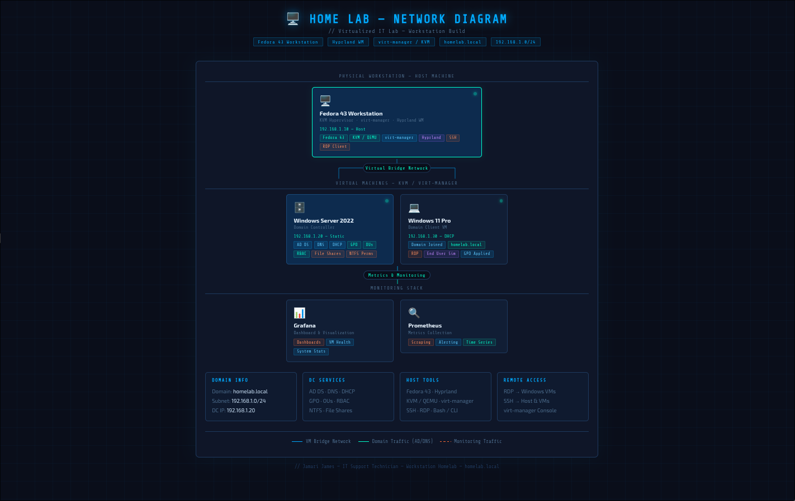

# 04 - Network Diagram

## Overview
Visual map of my virtualized home lab environment built on a 
Fedora 43 workstation using KVM and virt-manager.

## Lab Topology
- **Host:** Fedora 43 Workstation · Hyprland WM · KVM / virt-manager
- **VM 1:** Windows Server 2022 — Domain Controller (192.168.1.20)
- **VM 2:** Windows 11 Pro — Domain Client (192.168.1.30)
- **Domain:** homelab.local · Subnet: 192.168.1.0/24

## Services Running
- Active Directory Domain Services (AD DS)
- DNS — Forward & Reverse Lookup Zones
- DHCP — Auto IP assignment to clients
- Group Policy Objects (GPO)
- Grafana & Prometheus — System monitoring

## Diagram
