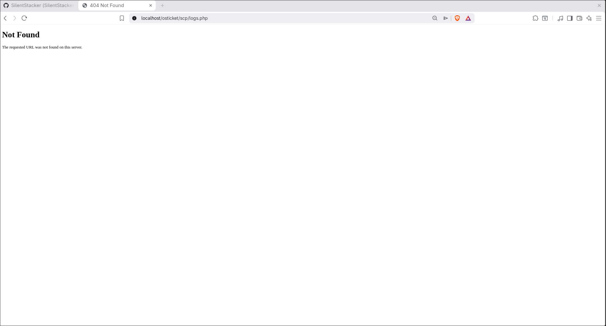
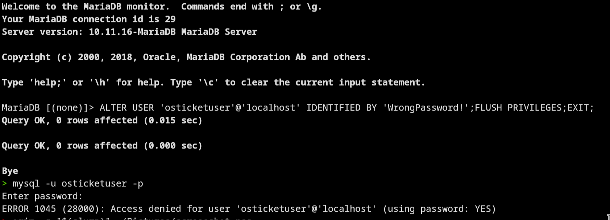
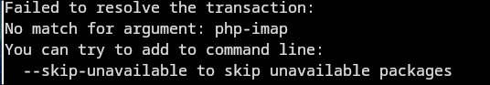
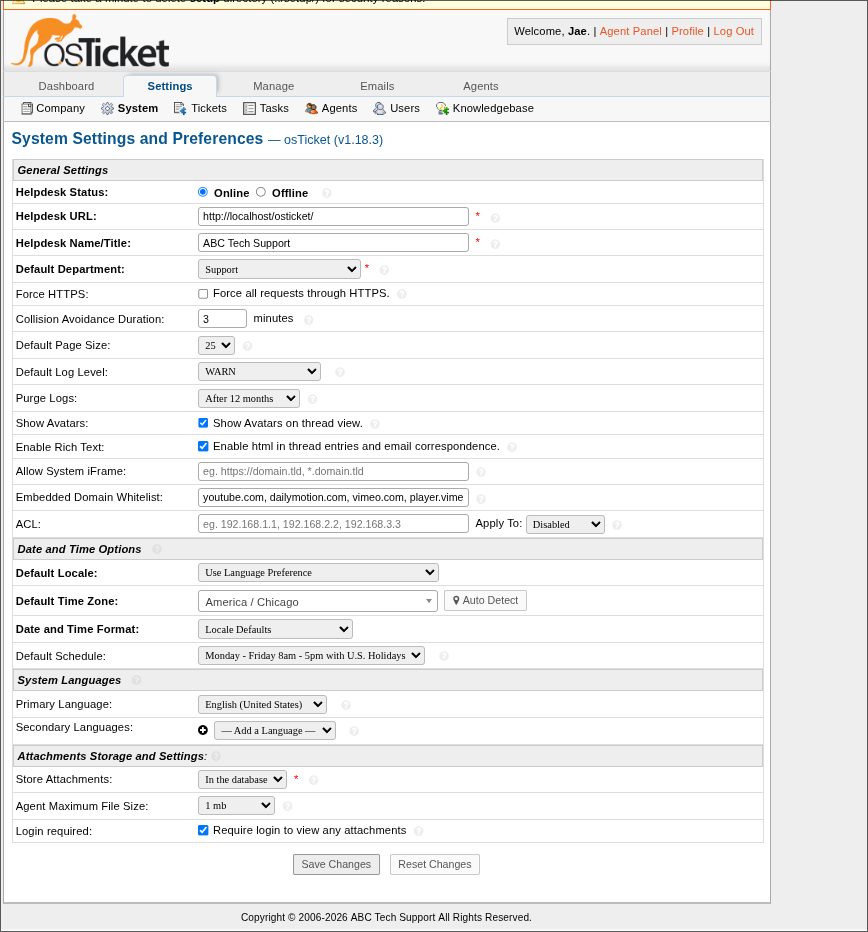

# 🛠️ Help Desk Ticketing Lab (osTicket)

> Deployed and troubleshot a full IT help desk environment on Fedora Linux using Apache, PHP, and MariaDB.

---

## 📌 Overview

This project simulates a real-world IT help desk environment using osTicket — an open-source ticketing system used by real companies. The lab focuses on hands-on experience with system deployment, service configuration, permission management, and structured troubleshooting.

Every error encountered during deployment was diagnosed, resolved, and documented to replicate real IT support workflows.

---

## 🧭 Lab Architecture

| Component | Details |
|---|---|
| Ticketing System | osTicket v1.18.3 (Linux-based) |
| OS | Fedora Linux |
| Web Server | Apache (httpd) |
| Backend | PHP + MariaDB (LAMP stack) |
| Virtualization | KVM / virt-manager |
| Domain Controller | Windows Server (AD DS, DNS) |
| Client Machine | Windows 11 Pro (domain joined) |
| Domain | homelab.local |

---

## ⚙️ What I Built

- Deployed osTicket on a Fedora Linux server from scratch
- Configured Apache, PHP, and MariaDB for full LAMP stack operation
- Resolved SELinux and file permission issues blocking web server access
- Diagnosed and fixed database authentication failures
- Installed and verified required PHP extensions
- Set up the osTicket admin panel with roles and user access
- Documented 14 real errors encountered during deployment
- Simulated real IT help desk ticket workflows

---

## 🧠 Key Skills Demonstrated

- Linux system administration (Fedora)
- Web server configuration (Apache/PHP)
- Database setup and troubleshooting (MariaDB/MySQL)
- File permissions and SELinux context management
- Service management with `systemctl`
- HTTP error diagnosis (403, 404, 500)
- Log analysis (`/var/log/httpd/error_log`)
- Git version control workflow
- Technical documentation

---

## 🔥 Troubleshooting Highlights

14 real errors were encountered and resolved during this lab. Below are some key examples:

### 🔴 HTTP 403 Forbidden — Permissions & SELinux
Apache was blocked from accessing the osTicket directory due to incorrect file ownership and SELinux restrictions.


**Fix:**
```bash
sudo chown -R apache:apache /var/www/html/osticket
sudo chmod -R 755 /var/www/html/osticket
sudo restorecon -Rv /var/www/html/osticket
```

---

### 🔴 HTTP 404 Not Found — Incorrect File Path
osTicket files were placed in the wrong directory, causing Apache to return a 404.



**Fix:**
```bash
sudo mv upload /var/www/html/osticket
```

---

### 🔴 HTTP 500 Internal Server Error — Backend Failure
The installer returned a 500 error on form submission due to a combination of database misconfiguration and hidden PHP errors.


**Fix:**
- Enabled PHP error display in `/etc/php.ini`
- Reset database credentials and permissions
- Restarted services:
```bash
sudo systemctl restart httpd mariadb
```

---

### 🔴 MySQL Error 1045 — Access Denied
Database authentication failed due to incorrect credentials set for the osTicket user.



**Fix:**
```sql
ALTER USER 'osticketuser'@'localhost' IDENTIFIED BY 'StrongPassword123!';
GRANT ALL PRIVILEGES ON osticket.* TO 'osticketuser'@'localhost';
FLUSH PRIVILEGES;
```

---

### 🔴 Missing IMAP PHP Extension
The osTicket installer flagged the `php-imap` module as unavailable in Fedora's repositories.



**Resolution:** Confirmed IMAP is optional for osTicket and continued installation with all required modules passing.

---

## 📸 osTicket Admin Dashboard

Successfully deployed and accessed the osTicket admin panel after resolving all installation errors.



---

## 🎫 Ticket Scenarios Practiced

Each scenario below follows a real help desk workflow: receive → investigate → resolve → document.

| Scenario | Skills Shown |
|---|---|
| Password reset / account lockout | AD user management, help desk communication |
| Network connectivity (DNS, IP conflict) | Networking, ping/nslookup diagnostics |
| Printer troubleshooting | Hardware support, driver management |
| Shared folder permissions | NTFS permissions, AD groups |
| System performance issues | Resource monitoring, basic diagnostics |

---

## 📈 Outcome

Successfully deployed a fully functional help desk system on Linux, diagnosed and resolved 14 real-world errors across web server configuration, database authentication, PHP dependencies, file permissions, and SELinux — and documented the entire process professionally.

---

## 🚧 In Progress / Next Steps

- [ ] Add Active Directory user and group management documentation
- [ ] Complete ticket scenario write-ups with full resolution notes
- [ ] Add network diagram of the virtual lab environment
- [ ] Add PowerShell automation scripts for common help desk tasks
- [ ] Configure email-based ticketing with IMAP/SMTP

---

## 👤 Author

**Jamari James**  
Aspiring IT Support Specialist  

👉 [View Full Troubleshooting Log](troubleshooting-log.md)
