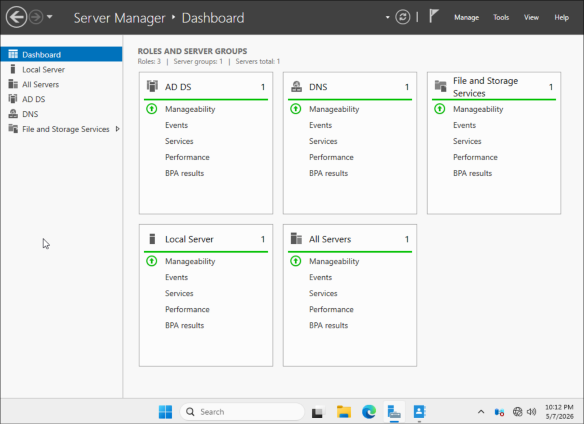
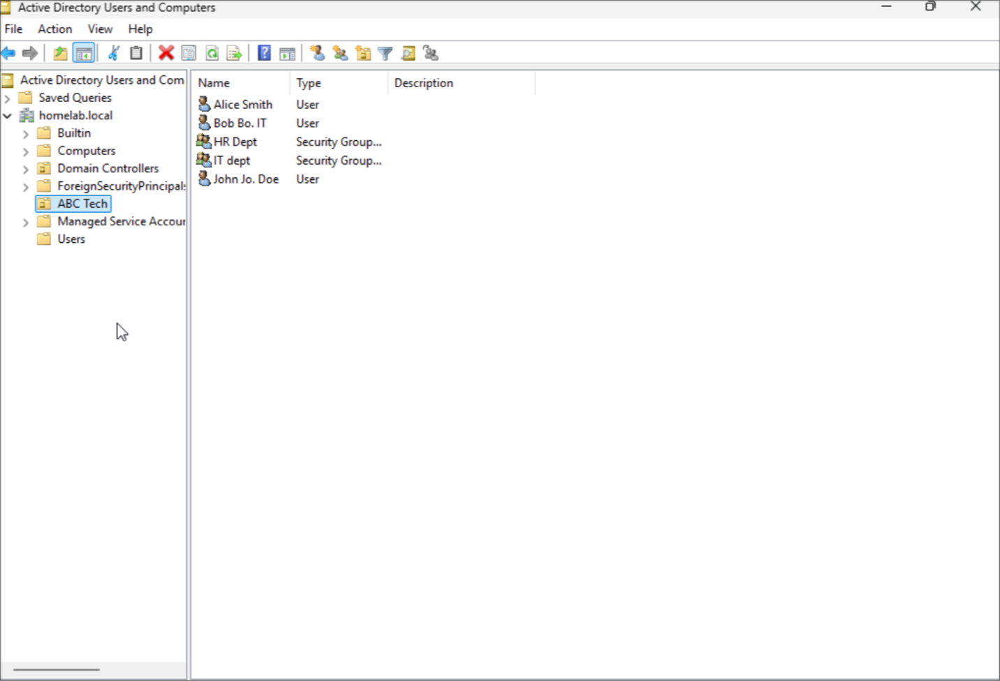
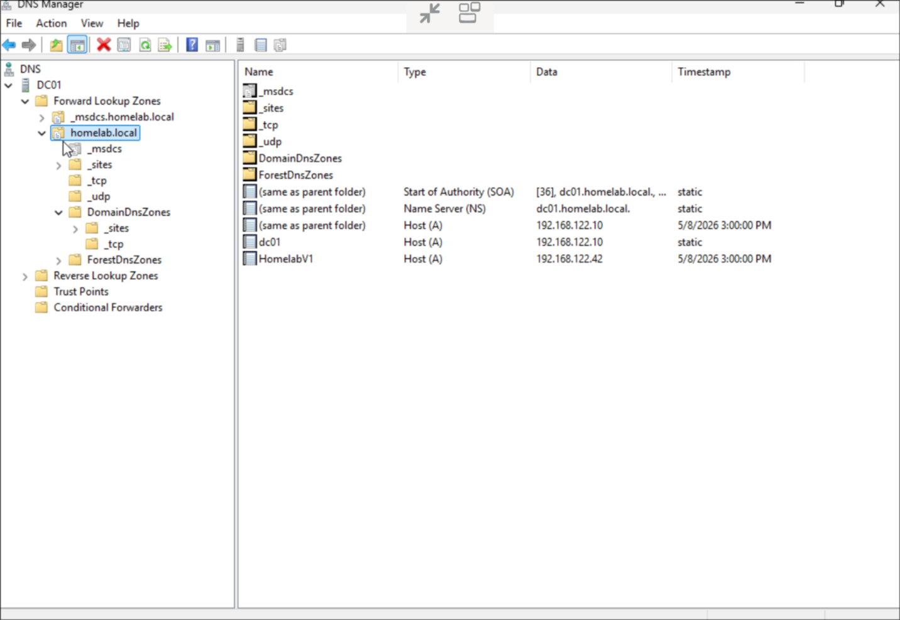
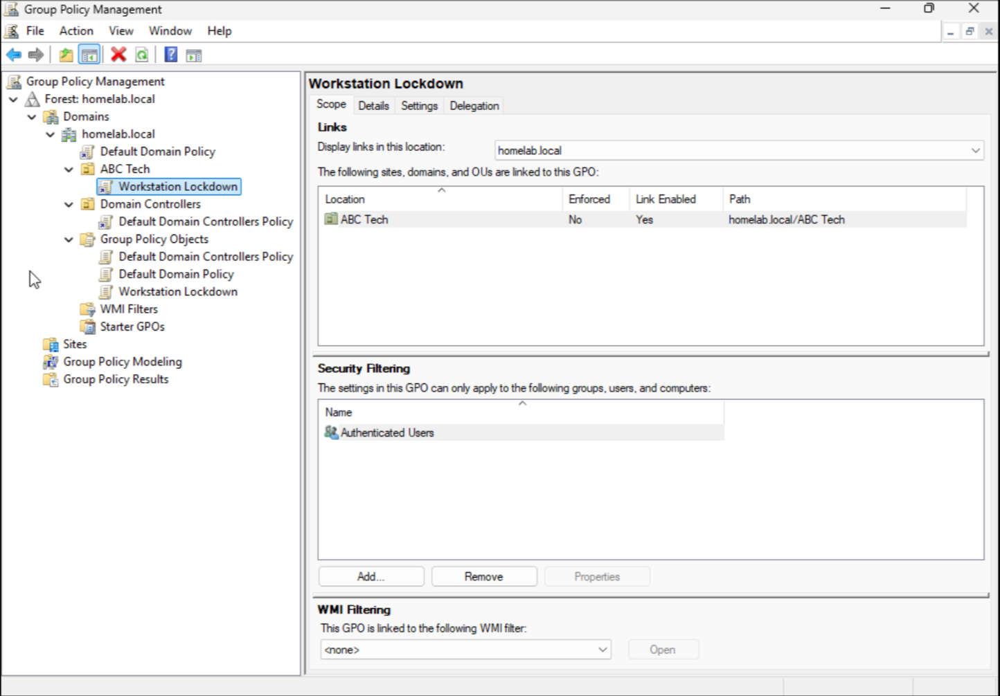
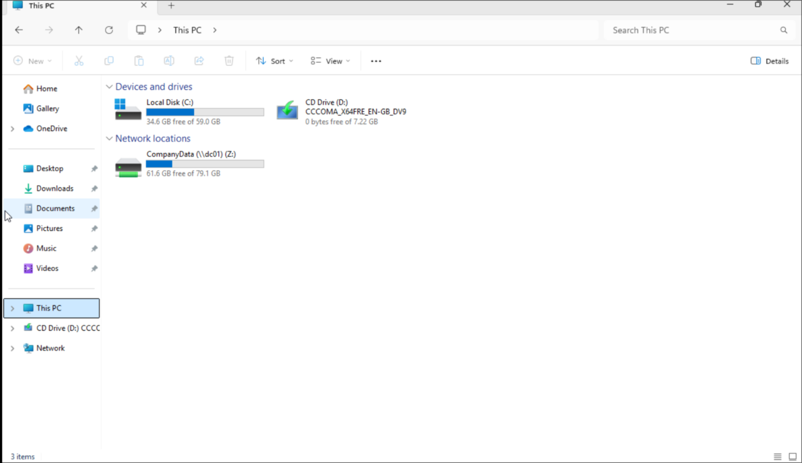
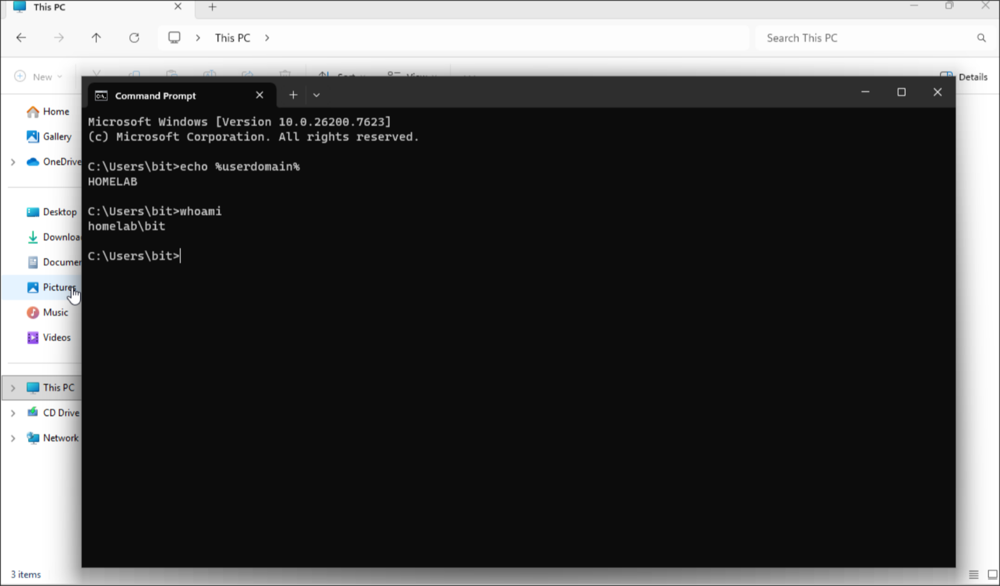

# 🛠️ IT Help Desk & Active Directory Lab

> Built and maintained by **Jamari James** — IT Support Technician  
> Hands-on enterprise lab built from scratch on a Fedora 43 workstation using KVM and virt-manager.

---

## 📌 Overview

This project simulates a real-world IT help desk and Active Directory environment.
It covers ticket management, Windows Server administration, DNS/DHCP, Group Policy,
PowerShell automation, and Linux system administration — all running in a
virtualized lab without relying on cloud services.

The lab replicates real support workflows including diagnosing problems, resolving
user issues, and documenting solutions the way a real helpdesk technician would.

---

## 🧭 Lab Architecture

| Component | Details |
|---|---|
| Host Machine | Fedora 43 Workstation + Hyprland WM |
| Hypervisor | KVM / virt-manager |
| Domain Controller | Windows Server 2022 (AD DS, DNS, DHCP) |
| Client Machine | Windows 11 Pro (domain joined) |
| Domain | homelab.local |
| Subnet | 192.168.1.0/24 |
| Monitoring | Grafana + Prometheus |

---

## 🧱 Lab Environment

- **Host:** Fedora 43 Workstation · Hyprland · KVM / virt-manager
- **VM 1:** Windows Server 2022 — Domain Controller
- **VM 2:** Windows 11 Pro — Domain Client
- **Help Desk:** osTicket on LAMP stack (Apache, PHP, MariaDB)
- **Monitoring:** Grafana dashboards + Prometheus metrics

---

## ⚙️ What I Built

- Deployed and configured Active Directory Domain Services (AD DS)
- Set up DNS forward/reverse lookup zones for homelab.local
- Configured DHCP for automatic IP assignment to clients
- Created OUs, users, and security groups with role-based access control
- Implemented Group Policy Objects (GPOs) — Workstation Lockdown linked to ABC Tech OU
- Automated bulk user creation via PowerShell and CSV
- Configured mapped network drives via GPO (CompanyData Z:)
- Deployed osTicket on a Linux LAMP stack for ticket workflow simulation
- Documented real troubleshooting logs with root cause and resolution

---

## 🧠 Key Skills Demonstrated

- Active Directory administration (AD DS, GPO, OUs, RBAC)
- DNS & DHCP configuration and troubleshooting
- Windows Server 2022 administration
- PowerShell scripting and automation
- Linux system administration (Fedora, Apache, PHP, MariaDB)
- Virtualization (KVM, virt-manager)
- IT help desk workflows and ticket documentation
- File permissions (NTFS, share-level, SELinux)
- System monitoring (Grafana, Prometheus)

---

## 🔥 Troubleshooting Highlights

- Fixed HTTP 404 errors caused by incorrect osTicket file paths
- Resolved 403 Forbidden issues via file permissions and SELinux
- Debugged PHP execution and missing module dependencies
- Resolved MySQL 1045 authentication errors
- Troubleshot DNS resolution failures between DC and client VM
- Fixed domain join errors and GPO application issues

👉 [View Full Troubleshooting Log](troubleshooting-log.md)

---

## 📂 Repository Structure
```
IT-Help-Desk-Active-Directory-Lab/
├── 01-installation/          # Lab setup and installation steps
├── 02-osticket-setup/        # osTicket LAMP stack deployment
├── 03-active-directory/      # AD DS, GPO, DNS, PowerShell bulk users
├── 04-network-diagram/       # Visual lab topology
├── 05-ticket-scenarios/      # Simulated help desk ticket workflows
├── troubleshooting-log.md    # Documented issues and resolutions
└── README.md                 # You are here
```
---

## 📸 Screenshots

### Server Manager Dashboard


### Active Directory Users & Computers


### DNS Forward Lookup Zone


### GPO — Workstation Lockdown


### Mapped Network Drive (Windows 11 Client)


### Domain Join Proof


---

## 🎫 Ticket Scenarios Practiced

- Password resets and account lockouts
- Network connectivity issues (DNS, IP conflicts)
- Shared folder permission errors
- New user onboarding via PowerShell
- GPO troubleshooting

👉 [View Ticket Scenarios](05-ticket-scenarios/)

---

## 📈 Outcome

Successfully built a fully functional enterprise IT lab from scratch —
demonstrating real helpdesk and sysadmin skills through hands-on
configuration, troubleshooting, and documentation.

---

## 👤 Author

**Jamari James**
IT Support Technician | Help Desk Lab Builder | CompTIA A+ (In Progress)

Built and documented this lab independently to demonstrate real-world
IT support skills without waiting for a first IT job.
